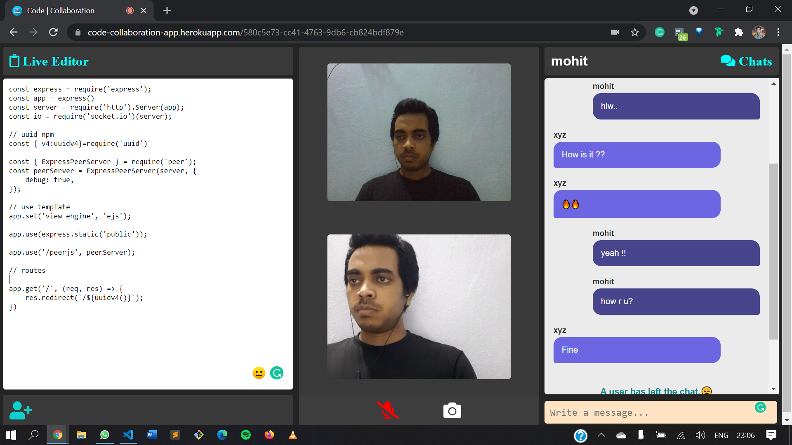

<h3>Hi 👋 everyone !! </h3>

<h3>Project details( link: https://code-collaboration-app.herokuapp.com/)</h3>

Build a real-time web application(<strong>code-collaboration-app</strong>) using socket.io that allows users to code collaboratively, instead of sharing the whole screen, all you just need to code on the live editor of the application, and your code would be visible to your peer one. you can ask for a review and edit with them.
 
apart from that, I have also added the video and text chat features with notifications about the new joinee and also if the user left the chat.

<h3>Project and files structure:</h3>

this application takes the new joinee name through the prompt box as you visit the website. there is also an option to get a shareable link to let other users join.

<string>Tools used</strong> : I have used <strong>Node.js, Express.js, and  socket.io</strong>( which is a javascript library that enables real-time, bidirectional, and event-based communication.) apart from that, I have also used <strong>UUID</strong> npm packages for generating a unique key for each user which is further concatenated with home route API. and client-side interface has been build using <strong>javascript, hbs, and CSS</strong>.</h4>
<h3>Screenshots:

### thanks !!